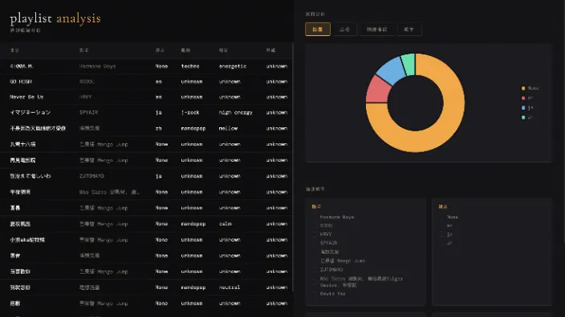

# 🎧 Database Final Project：Spotify Music Analyzing & Create a Playlist

## 📌 Project Purpose

This application utilizes the Spotify API to collect a user's top 20 most-listened-to tracks in the past six months. It analyzes the data (such as song language, genre, artist, timing, gender, etc.), visualizes the statistics, and allows users to **filter and generate customized Spotify playlists** based on their preferences.



---

## 💾 Data Sources

| Table    | Source |
|----------|--------|
| `Album`  | Album dataset |
| `Singer` | Spotify Artist Metadata (Top 10k) |
| `Song`   | Spotify Tracks Dataset |
| `Playlist` | Spotify API |

- **ER diagram** and schema are detailed in the project report (`Database_Project_Team04.pdf`)

---

## 🔧 Application Workflow

### 🔐 1. Login (Spotify Authorization)
- User clicks to authorize with Spotify
- Application retrieves access token
- Fetches top 20 tracks via Spotify API
- Song lyrics are analyzed with **Genius API** to detect language
- Data is saved to `playlist.csv`

---

### 📊 2. Data Analysis
- CSV data is imported into MySQL (`Playlist` table)
- Joined with `Song`, `Singer`, and `Album` tables
- Returns info like:
  - Genre
  - Emotion
  - Album name
  - Singer gender
- Data is displayed in HTML tables + **pie charts**

---

### 🎼 3. Playlist Creation
- User selects filtering options (genre/language/etc.)
- Application uses selected options to filter songs
- Sends request to Spotify API to generate a new playlist
- Playlist link is returned and displayed

---

## 🚀 Setup

### Prerequisites
- Python 3.x
- MySQL 8.x
- A Spotify Developer account ([Create app here](https://developer.spotify.com/dashboard))

### 1. Database

```sql
CREATE DATABASE final_project;
```

Import the schema files:

```bash
mysql -u root -p final_project < Singer.sql
mysql -u root -p final_project < Song.sql
mysql -u root -p final_project < Album.sql
```

### 2. Configuration

Edit `interface.py` and update the database config and Spotify credentials:

```python
db_config = {
    'host': 'localhost',
    'user': 'root',
    'password': 'YOUR_PASSWORD',
    'database': 'final_project'
}

CLIENT_ID = "YOUR_SPOTIFY_CLIENT_ID"
CLIENT_SECRET = "YOUR_SPOTIFY_CLIENT_SECRET"
```

In your Spotify app dashboard, add `http://localhost:8888/spotify_callback` as a Redirect URI.

### 3. Install & Run

```bash
pip install -r requirements.txt
python interface.py
```

Open [http://localhost:8888](http://localhost:8888)

---

## 🔗 Links

- **GitHub Repository**:  
  [https://github.com/tingyun1412/Database-Final-Project](https://github.com/tingyun1412/Database-Final-Project)

- **Demo Video**:  
  [https://youtu.be/Xta4iSIw7hg?si=5s8pI2CYruIfi_Oq](https://youtu.be/Xta4iSIw7hg?si=5s8pI2CYruIfi_Oq)
